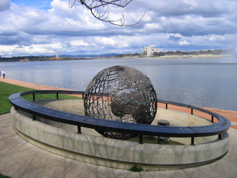
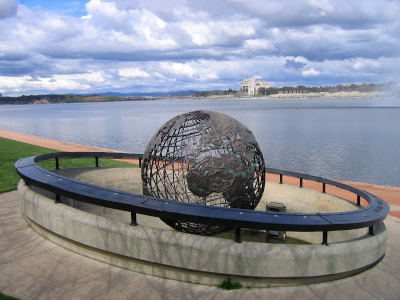
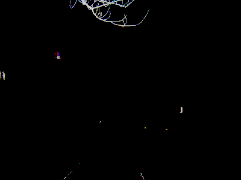

# imgcmp

A simple pixel-wise image comparator.

This tool compares between two images pixel by pixel. The features of this tool are minimal since it is designed for a very specific usecase as a part of an autograding tool in a computer graphics course. It only supports RGB images and it computes the absolute error in the sRGB space. For a tool with support for the alpha channel, antialiased images and comparison in YIQ NTSC transmission color space, I recommend [pixelmatch](https://github.com/mapbox/pixelmatch) by mapbox.

## How it works

For each pixel, the channels are compared with their counterparts.
If the value error for any channel exceeds the threshold, the whole pixel is considered different. If the number of different pixels exceeds the specificied limit, the result is a mismatch. The exit code will be 0 if the images match and -1 if they don't.

When generating an error image, channels that don't pass the threshold will be kept 0. Otherwise the channel's value will be 128 (half intensity) plus half the error value.

## Usage

    imgcmp [options] <path-to-1st-image> <path-to-2nd-image>

Options:
* `-s, --silent`: Run in silent mode. No console output will be generated. Default: false.
* `-v, --verbose`: Run in verbose mode. Extra console output will be generated. Default: false.
* `-o <path-to-error-image>`: Outputs the pixel error into a png image at the given path.
* `-t <pixel-threshold>`: Sets a threshold [0-1] on the maximum allowed per-channel error. if 0, any difference passes the threshold. if 1, nothing passes the threshold. Default: 0.
* `-e <count>`: Sets the number of pixels allowed to be different before the result is considered a mismatch. Default: 0.
* `-e <percent>%`: Sets the percentage of pixels allowed to be different before the result is considered a mismatch.
* `-h, --help`: Prints usage info then exits.

## Example

    > imgcmp image1.png image2.png -o difference.png -t 0.1 -v
    MISMATCH DETECTED
    Different Pixels: 1.03667%

|  |  |  |
| :---: | :---: | :---: |
| `image1.png` | `image2.png` | `difference.png` |

Image source: [Globe and high court (Spot the difference).jpg](https://commons.wikimedia.org/wiki/File:Globe_and_high_court_(Spot_the_difference).jpg)

## Included Libraries

* [stb](https://github.com/nothings/stb)
* [flags](https://github.com/sailormoon/flags)